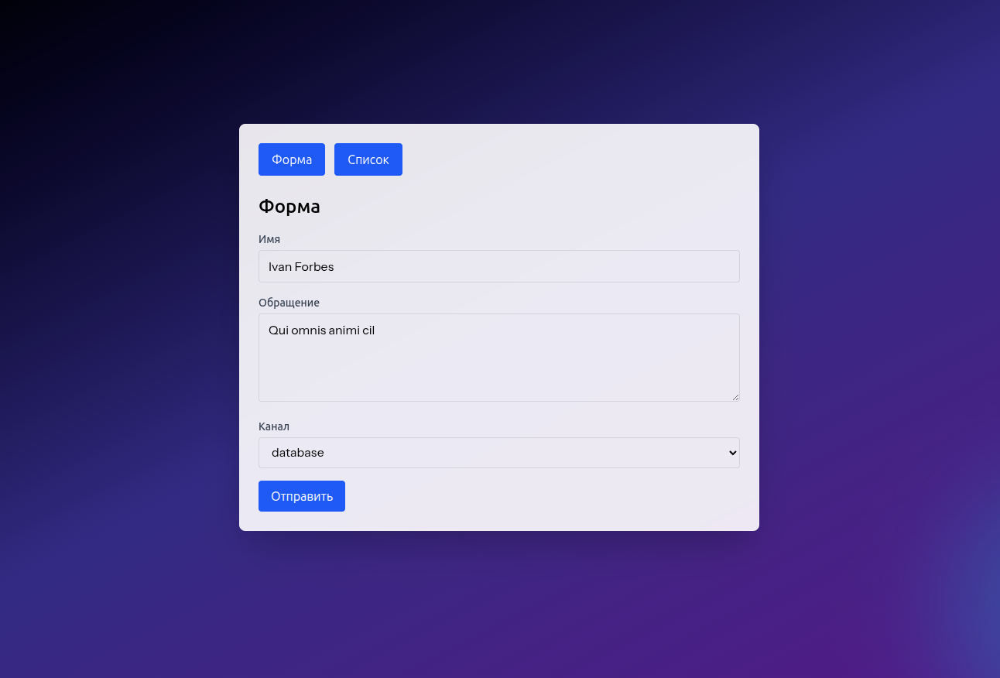
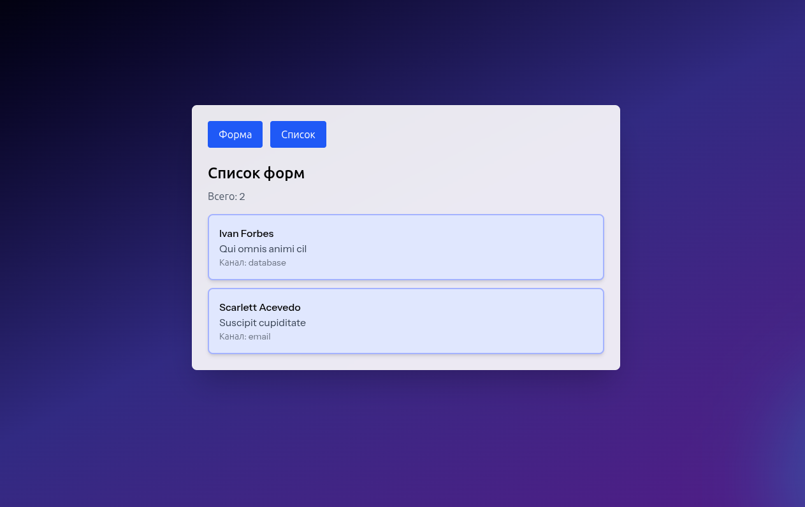

# Envybox Test Task (Laravel + Vue SPA)

Тестовое приложение "форма обратной связи" на Laravel + Vue.

## Стек

- Backend: `Laravel`, `PHP 8+`
- Frontend: `Vue 3`, `Vuex 4`, `Vue Router 4`, `Vite`, `Tailwind CSS`

## Что реализовано

- SPA с 2 страницами:
  - `Форма` — отправка данных на backend
  - `Список` — отображение отправленных форм из Vuex (без запроса к backend)
- Переходы между страницами через `vue-router` без перезагрузки.
- Backend API: `POST /api/feedback`.
- Валидация через `StoreFeedbackRequest`.
- Простая фабрика сохранения:
  - канал `database` или `email` передается в фабрику при создании
  - у фабрики есть метод `save()`
  - внутри выбирается нужный saver (`DatabaseSaver` / `EmailSaver`)

## Структура (ключевые файлы)

- `resources/js/pages/FormPage.vue`
- `resources/js/pages/ListPage.vue`
- `resources/js/store/index.ts`
- `app/Http/Controllers/Api/FeedbackController.php`
- `app/Http/Requests/StoreFeedbackRequest.php`
- `app/Services/Feedback/Factories/SaverFactory.php`
- `app/Services/Feedback/Savers/DatabaseSaver.php`
- `app/Services/Feedback/Savers/EmailSaver.php`
- `routes/api.php`

## Запуск проекта

```bash
composer install
npm install
```

```bash
php artisan serve
```

В отдельном терминале:

```bash
npm run dev
```

Открыть: `http://127.0.0.1:8000`

## Скриншоты



